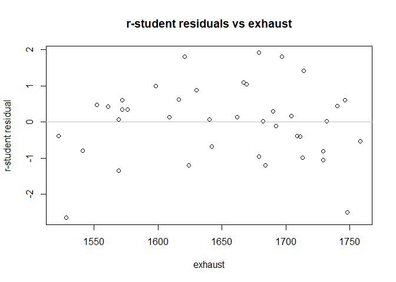

#### comment out – use in the case where “html” is used

#### \`\`\`{r setup, include=TRUE, results=“asis”}

#### Perform data housekeeping - upload, name columns, display to make sure it reads properly, etc.

``` r
knitr::opts_chunk$set(echo = TRUE)

#Sys.setenv(JAVA_HOME='C:\\Program Files\\Java\\jdk-14.0.1') # for 64-bit version
#library(rJava)

library("xlsx") # Needed to read data
```

    ## Warning: package 'xlsx' was built under R version 4.0.4

``` r
library(MuMIn)
```

    ## Warning: package 'MuMIn' was built under R version 4.0.3

``` r
library(MASS)   # Needed for ginv() function


jt_data <- read.xlsx("data-table-B13.xlsx", sheetIndex = 1, sheetName=NULL, rowIndex=NULL, startRow=NULL, endRow=NULL, colIndex= NULL, as.data.frame=TRUE, header=TRUE, colClasses=NA, keepFormulas=FALSE, encoding="unknown")

# Give labels to data columns
names(jt_data) <- c("thrust", "primary", "secondary", "fuel", "press", "exhaust", "ambient")
attach(jt_data)

# Output data to make sure it reads properly
jt_data # Note: On the spreadsheet provided on the course website, Observation #7 is 580 but in Table 8.1 and subsequent textbook results tables it is 680.
```

    ##    thrust primary secondary  fuel press exhaust ambient
    ## 1    4540    2140     20640 30250   205    1732      99
    ## 2    4315    2016     20280 30010   195    1697     100
    ## 3    4095    1905     19860 29780   184    1662      97
    ## 4    3650    1675     18980 29330   164    1598      97
    ## 5    3200    1474     18100 28960   144    1541      97
    ## 6    4833    2239     20740 30083   216    1709      87
    ## 7    4617    2120     20305 29831   206    1669      87
    ## 8    4340    1990     19961 29604   196    1640      87
    ## 9    3820    1702     18916 29088   171    1572      85
    ## 10   3368    1487     18012 28675   149    1522      85
    ## 11   4445    2107     20520 30120   195    1740     101
    ## 12   4188    1973     20130 29920   190    1711     100
    ## 13   3981    1864     19780 29720   180    1682     100
    ## 14   3622    1674     19020 29370   161    1630     100
    ## 15   3125    1440     18030 28940   139    1572     101
    ## 16   4560    2165     20680 30160   208    1704      98
    ## 17   4340    2048     20340 29960   199    1679      96
    ## 18   4115    1916     19860 29710   187    1642      94
    ## 19   3630    1658     18950 29250   164    1576      94
    ## 20   3210    1489     18700 28890   145    1528      94
    ## 21   4330    2062     20500 30190   193    1748     101
    ## 22   4119    1929     20050 29960   183    1713     100
    ## 23   3891    1815     19680 29770   173    1684     100
    ## 24   3467    1595     18890 29360   153    1624      99
    ## 25   3045    1400     17870 28960   134    1569     100
    ## 26   4411    2047     20540 30160   193    1746      99
    ## 27   4203    1935     20160 29940   184    1714      99
    ## 28   3968    1807     19750 29760   173    1679      99
    ## 29   3531    1591     18890 29350   153    1621      99
    ## 30   3074    1388     17870 28910   133    1561      99
    ## 31   4350    2071     20460 30180   198    1729     102
    ## 32   4128    1944     20010 29940   186    1692     101
    ## 33   3940    1831     19640 29750   178    1667     101
    ## 34   3480    1612     18710 29360   156    1609     101
    ## 35   3064    1410     17780 28900   136    1552     101
    ## 36   4402    2066     20520 30170   197    1758     100
    ## 37   4180    1954     20150 29950   188    1729      99
    ## 38   3973    1835     19750 29740   178    1690      99
    ## 39   3530    1616     18850 29320   156    1616      99
    ## 40   3080    1407     17910 28910   137    1569     100

``` r
# Output data structure and dimensions
str(jt_data)
```

    ## 'data.frame':    40 obs. of  7 variables:
    ##  $ thrust   : num  4540 4315 4095 3650 3200 ...
    ##  $ primary  : num  2140 2016 1905 1675 1474 ...
    ##  $ secondary: num  20640 20280 19860 18980 18100 ...
    ##  $ fuel     : num  30250 30010 29780 29330 28960 ...
    ##  $ press    : num  205 195 184 164 144 216 206 196 171 149 ...
    ##  $ exhaust  : num  1732 1697 1662 1598 1541 ...
    ##  $ ambient  : num  99 100 97 97 97 87 87 87 85 85 ...

``` r
dim(jt_data)
```

    ## [1] 40  7

``` r
jt_lm <- lm(thrust~primary+secondary+fuel+press+exhaust+ambient, data=jt_data, na.action = "na.fail") # Linear model of raw data

# Use dredge() function to automatically perform all regressors regression
combinations <- dredge(jt_lm, extra = c(R_Sq = function(x) summary(x)$r.squared,R_Sq_Adj = function(x) summary(x)$adj.r.squared, MS_Res = function(x) summary(x)$sigma^2,Cp, MallowCp = function(x) summary(x)$sigma^2*df.residual(x)/summary(jt_lm)$sigma^2-dim(jt_data)[1]+2*length(x$coefficients)))
```

    ## Fixed term is "(Intercept)"

``` r
print(combinations)
```

    ## Global model call: lm(formula = thrust ~ primary + secondary + fuel + press + exhaust + 
    ##     ambient, data = jt_data, na.action = "na.fail")
    ## ---
    ## Model selection table 
    ##      (Intrc)    ambnt    exhst     fuel     press  prmry     scndr    R_Sq
    ## 24  -4280.00 -17.5100  0.64670  0.20980           1.4420           0.99750
    ## 32  -3982.00 -16.2800  0.83430  0.18430  3.746000 1.0960           0.99760
    ## 28     37.62 -12.9900  1.26000           4.608000 1.2410           0.99740
    ## 22  -7018.00 -17.8400           0.34430           1.3630           0.99720
    ## 20    366.80 -13.9800  1.09700                    1.7060           0.99720
    ## 56  -4976.00 -18.1500  0.63070  0.25270           1.4710 -0.027500 0.99750
    ## 64  -4738.00 -16.9500  0.82190  0.23060  3.850000 1.1190 -0.030180 0.99770
    ## 54  -7763.00 -18.5900           0.39120           1.4000 -0.032610 0.99730
    ## 30  -7190.00 -17.4500           0.34900  1.296000 1.2360           0.99720
    ## 60    -21.22 -13.0300  1.23800           4.534000 1.2280  0.006968 0.99740
    ## 52    233.90 -14.0200  1.05700                    1.6620  0.014440 0.99720
    ## 62  -7993.00 -18.1900           0.39870  1.455000 1.2580 -0.034210 0.99730
    ## 16  -7205.00 -17.3000  1.11100  0.29530 12.700000                  0.99660
    ## 48  -7630.00 -17.6600  1.10700  0.32040 12.850000        -0.015610 0.99660
    ## 50    417.20  -9.1780                             1.7520  0.062050 0.99600
    ## 18   1103.00  -8.0730                             1.9820           0.99570
    ## 12   -947.30 -11.8200  1.91600          16.260000                  0.99590
    ## 14 -12230.00 -19.1100           0.54380 10.880000                  0.99580
    ## 44  -1224.00 -12.1000  1.74900          15.110000         0.040110 0.99600
    ## 26   1106.00  -8.0950                   -0.055790 1.9870           0.99570
    ## 58    417.00  -9.1760                    0.004801 1.7520  0.062050 0.99600
    ## 46 -12720.00 -19.5300           0.57300 11.060000        -0.018710 0.99580
    ## 31   6870.00           1.29100 -0.31060 10.020000 1.2970           0.99460
    ## 63   7381.00           1.28100 -0.35350  9.420000 1.2480  0.049720 0.99470
    ## 25    218.70                            10.930000 0.9826           0.99310
    ## 29   2961.00                   -0.10270  6.796000 1.5450           0.99360
    ## 23   8473.00           0.82290 -0.34710           2.4020           0.99340
    ## 21   5281.00                   -0.18860           2.3250           0.99300
    ## 55   9079.00           0.84830 -0.40640           2.2340  0.072520 0.99370
    ## 61   3536.00                   -0.14990  6.193000 1.4900  0.052690 0.99370
    ## 53   5764.00                   -0.24040           2.1620  0.068900 0.99320
    ## 57    350.80                            10.680000 1.0430 -0.010150 0.99320
    ## 27    138.00           0.06337          11.500000 0.9145           0.99320
    ## 15   3829.00           1.65700 -0.21490 21.210000                  0.99310
    ## 47   4712.00           1.62200 -0.28030 19.770000         0.069820 0.99340
    ## 11   -612.30           0.63980          19.820000                  0.99230
    ## 59    300.60           0.13330          11.650000 0.9545 -0.019340 0.99320
    ## 42  -1354.00  -4.8180                   15.080000         0.158800 0.99270
    ## 43   -668.10           0.59880          19.600000         0.008317 0.99230
    ## 41   -931.10                            18.060000         0.086400 0.99170
    ## 19   1086.00          -0.65240                    2.1520           0.99160
    ## 13  -2259.00                    0.09179 19.750000                  0.99130
    ## 45  -1118.00                    0.01063 18.150000         0.079010 0.99170
    ## 51   1117.00          -0.64180                    2.1620 -0.003383 0.99160
    ## 9     165.00                            21.430000                  0.99020
    ## 49   1283.00                                      2.2760 -0.076800 0.99060
    ## 17    296.90                                      1.9930           0.99000
    ## 10    106.00   0.5735                   21.440000                  0.99030
    ## 6  -24590.00 -39.1200           1.09100                            0.99010
    ## 38 -21610.00 -35.8900           0.92750                   0.079720 0.99040
    ## 8  -25320.00 -38.7400 -0.27400  1.13000                            0.99010
    ## 40 -22200.00 -35.7700 -0.17780  0.95890                   0.076670 0.99040
    ## 36  -4496.00 -24.8300  1.73800                            0.407700 0.98300
    ## 34  -4619.00 -17.5700                                     0.525000 0.97960
    ## 35  -5740.00          -1.70500                            0.639200 0.96030
    ## 37   1800.00                   -0.40070                   0.716500 0.96020
    ## 39  -1870.00          -0.97730 -0.20330                   0.687700 0.96090
    ## 33  -6301.00                                              0.523500 0.95270
    ## 4   -3585.00 -48.3100  7.38300                                     0.94520
    ## 7  -39690.00          -5.28600  1.76800                            0.88760
    ## 5  -25860.00                    1.00500                            0.86270
    ## 3   -6643.00           6.38500                                     0.75980
    ## 1    3904.00                                                       0.00000
    ## 2    5441.00 -15.7700                                              0.02174
    ##     R_Sq_Adj   MS_Res       Cp  MallowCp df   logLik  AICc  delta weight
    ## 24  0.997200    714.2    32140     5.572  6 -185.510 385.6   0.00  0.239
    ## 32  0.997300    694.9    31970     5.623  7 -184.383 386.3   0.70  0.169
    ## 28  0.997100    740.1    33300     6.862  6 -186.223 387.0   1.42  0.117
    ## 22  0.997000    772.3    33980     7.566  5 -187.639 387.0   1.48  0.114
    ## 20  0.996900    779.0    34280     7.909  5 -187.811 387.4   1.82  0.096
    ## 56  0.997200    724.5    33330     7.054  7 -185.217 387.9   2.37  0.073
    ## 64  0.997200    702.7    33030     7.000  8 -184.009 388.7   3.10  0.051
    ## 54  0.996900    779.7    35090     8.834  6 -187.265 389.1   3.51  0.041
    ## 30  0.996900    788.9    35500     9.293  6 -187.500 389.5   3.98  0.033
    ## 60  0.997000    761.0    35000     8.818  7 -186.199 389.9   4.33  0.027
    ## 52  0.996900    797.4    35880     9.716  6 -187.714 390.0   4.41  0.026
    ## 62  0.996900    795.5    36590    10.490  7 -187.087 391.7   6.11  0.011
    ## 16  0.996200    972.0    43740    18.410  6 -191.674 397.9  12.33  0.001
    ## 48  0.996100    997.1    45870    20.240  7 -191.605 400.7  15.14  0.000
    ## 50  0.995700   1105.0    48600    24.590  5 -194.795 401.4  15.79  0.000
    ## 18  0.995500   1152.0    49530    26.650  4 -196.183 401.5  15.94  0.000
    ## 12  0.995600   1121.0    49340    25.450  5 -195.097 402.0  16.39  0.000
    ## 14  0.995500   1150.0    50590    26.900  5 -195.597 403.0  17.39  0.000
    ## 44  0.995600   1122.0    50510    25.910  6 -194.553 403.7  18.08  0.000
    ## 26  0.995400   1184.0    52090    28.650  5 -196.183 404.1  18.56  0.000
    ## 58  0.995500   1136.0    51130    26.590  6 -194.795 404.1  18.57  0.000
    ## 46  0.995400   1178.0    53000    28.660  6 -195.514 405.6  20.01  0.000
    ## 31  0.994000   1540.0    69320    46.720  6 -200.883 416.3  30.74  0.000
    ## 63  0.993900   1547.0    71150    46.830  7 -200.384 418.3  32.70  0.000
    ## 25  0.992800   1840.0    79130    62.900  4 -205.553 420.2  34.68  0.000
    ## 29  0.993000   1774.0    78040    58.860  5 -204.266 420.3  34.73  0.000
    ## 23  0.992900   1809.0    79600    60.680  5 -204.661 421.1  35.52  0.000
    ## 21  0.992600   1884.0    80990    65.180  4 -206.017 421.2  35.61  0.000
    ## 55  0.993000   1778.0    80000    58.540  6 -203.748 422.0  36.48  0.000
    ## 61  0.993000   1782.0    80180    58.740  6 -203.793 422.1  36.57  0.000
    ## 53  0.992700   1863.0    81970    63.440  5 -205.248 422.3  36.70  0.000
    ## 57  0.992600   1889.0    83120    64.770  5 -205.526 422.8  37.25  0.000
    ## 27  0.992600   1890.0    83140    64.810  5 -205.533 422.8  37.26  0.000
    ## 15  0.992500   1907.0    83890    65.680  5 -205.712 423.2  37.62  0.000
    ## 47  0.992600   1885.0    84830    63.890  6 -204.922 424.4  38.82  0.000
    ## 11  0.991900   2056.0    88410    74.260  4 -207.769 424.7  39.11  0.000
    ## 59  0.992400   1937.0    87150    66.460  6 -205.462 425.5  39.90  0.000
    ## 42  0.992000   2025.0    89110    71.760  5 -206.920 425.6  40.04  0.000
    ## 43  0.991700   2112.0    92920    76.190  5 -207.756 427.3  41.71  0.000
    ## 41  0.991200   2231.0    95940    83.470  4 -209.403 427.9  42.38  0.000
    ## 19  0.991200   2245.0    96530    84.200  4 -209.527 428.2  42.63  0.000
    ## 13  0.990900   2322.0    99860    88.270  4 -210.204 429.6  43.99  0.000
    ## 45  0.991000   2292.0   100800    85.410  5 -209.393 430.6  44.98  0.000
    ## 51  0.990900   2307.0   101500    86.190  5 -209.525 430.8  45.25  0.000
    ## 9   0.990000   2549.0   107000   101.800  3 -212.599 431.9  46.30  0.000
    ## 49  0.990100   2510.0   107900    98.180  4 -211.762 432.7  47.10  0.000
    ## 17  0.989800   2602.0   109300   104.700  3 -213.012 432.7  47.13  0.000
    ## 10  0.989800   2610.0   112200   103.400  4 -212.542 434.2  48.66  0.000
    ## 6   0.989500   2665.0   114600   106.300  4 -212.955 435.1  49.49  0.000
    ## 38  0.989600   2645.0   116400   103.500  5 -212.257 436.3  50.71  0.000
    ## 8   0.989300   2724.0   119800   107.500  5 -212.844 437.5  51.89  0.000
    ## 40  0.989300   2714.0   122100   105.200  6 -212.210 439.0  53.40  0.000
    ## 36  0.981600   4698.0   206700   208.700  5 -223.750 459.3  73.70  0.000
    ## 34  0.978500   5469.0   235200   253.900  4 -227.334 463.8  78.25  0.000
    ## 35  0.958200  10650.0   458000   526.800  4 -240.668 490.5 104.91  0.000
    ## 37  0.958000  10700.0   459900   529.100  4 -240.749 490.6 105.08  0.000
    ## 39  0.957600  10800.0   475200   521.300  5 -240.397 492.6 106.99  0.000
    ## 33  0.951400  12370.0   519600   633.000  3 -244.193 495.1 109.49  0.000
    ## 4   0.942300  14700.0   632200   740.100  4 -247.114 503.4 117.80  0.000
    ## 7   0.881500  30170.0  1297000  1555.000  4 -261.490 532.1 146.56  0.000
    ## 5   0.859000  35900.0  1508000  1905.000  3 -265.500 537.7 152.10  0.000
    ## 3   0.753500  62770.0  2636000  3358.000  3 -276.676 560.0 174.45  0.000
    ## 1   0.000000 254700.0 10440000 14100.000  2 -305.205 614.7 229.17  0.000
    ## 2  -0.004005 255700.0 10740000 13790.000  3 -304.766 616.2 230.63  0.000
    ## Models ranked by AICc(x)

``` r
# Note - the book calculates Cp very differently than R does. The "Cp" column is done automatically through R and the 'MallowCp' column calculates it manually using the formula in the book.

# Reproduce the analysis for the candidate models in the video.
```

#### Influence analysis from the full model

``` r
# full model lm()
model <- lm(thrust~primary+secondary+fuel+press+exhaust+ambient) 
summary(model)
```

    ## 
    ## Call:
    ## lm(formula = thrust ~ primary + secondary + fuel + press + exhaust + 
    ##     ambient)
    ## 
    ## Residuals:
    ##     Min      1Q  Median      3Q     Max 
    ## -49.949 -19.028  -1.572  17.139  49.606 
    ## 
    ## Coefficients:
    ##               Estimate Std. Error t value Pr(>|t|)    
    ## (Intercept) -4.738e+03  2.445e+03  -1.938 0.061213 .  
    ## primary      1.119e+00  2.865e-01   3.904 0.000441 ***
    ## secondary   -3.018e-02  3.823e-02  -0.789 0.435478    
    ## fuel         2.306e-01  1.180e-01   1.954 0.059231 .  
    ## press        3.850e+00  2.686e+00   1.433 0.161246    
    ## exhaust      8.219e-01  3.508e-01   2.343 0.025298 *  
    ## ambient     -1.695e+01  2.620e+00  -6.468 2.45e-07 ***
    ## ---
    ## Signif. codes:  0 '***' 0.001 '**' 0.01 '*' 0.05 '.' 0.1 ' ' 1
    ## 
    ## Residual standard error: 26.51 on 33 degrees of freedom
    ## Multiple R-squared:  0.9977, Adjusted R-squared:  0.9972 
    ## F-statistic:  2350 on 6 and 33 DF,  p-value: < 2.2e-16

``` r
anova(model)
```

    ## Analysis of Variance Table
    ## 
    ## Response: thrust
    ##           Df  Sum Sq Mean Sq    F value    Pr(>F)    
    ## primary    1 9833160 9833160 13993.0720 < 2.2e-16 ***
    ## secondary  1    5992    5992     8.5274  0.006263 ** 
    ## fuel       1   25819   25819    36.7413 8.052e-07 ***
    ## press      1    4707    4707     6.6982  0.014240 *  
    ## exhaust    1    9772    9772    13.9056  0.000721 ***
    ## ambient    1   29397   29397    41.8337 2.450e-07 ***
    ## Residuals 33   23190     703                         
    ## ---
    ## Signif. codes:  0 '***' 0.001 '**' 0.01 '*' 0.05 '.' 0.1 ' ' 1

``` r
# sequence of observations
Obs <- seq(1, length(thrust))

influence_stats <- data.frame(cbind(Obs))

# R-student
r_student <- rstudent(model)
influence_stats$r_student <- data.frame(cbind(r_student))

# calculate hat matrix automatically
hat_diags <- lm.influence(model)$hat
influence_stats$hat_ii <- data.frame(cbind(hat_diags))

#### this section as a check on observation 14
X <- cbind(matrix(1,length(thrust),1),
           as.matrix(primary),
           as.matrix(secondary),
           as.matrix(fuel),
           as.matrix(press),
           as.matrix(exhaust),
           as.matrix(ambient))
y <- as.matrix(thrust)

xTx <- t(X) %*% X
H_matrix <- X %*% ginv(xTx, tol=.Machine$double.eps) %*% t(X)

# get the diagonal
diag(H_matrix)
```

    ##  [1] 0.12994307 0.12250028 0.06338237 0.07278295 0.15639595 0.30013879
    ##  [7] 0.22509487 0.17833859 0.26643906 0.31359530 0.49868576 0.15367090
    ## [13] 0.16480427 0.10883324 0.21108009 0.21532500 0.11930778 0.10651238
    ## [19] 0.13896439 0.74092500 0.16172386 0.08827135 0.09072730 0.12909248
    ## [25] 0.18765157 0.15834909 0.10074719 0.14878392 0.12499829 0.16160608
    ## [31] 0.10937081 0.07117872 0.12171270 0.12504443 0.22537912 0.15126268
    ## [37] 0.19029046 0.15810527 0.04571739 0.16326465

``` r
#### this section as a check on observation 14

# Cooks D
D_i_auto <- cooks.distance(model)
influence_stats$Cooks_D <- c(D_i_auto)

#### as a check on observation 14
# Calculate studentized residuals, r_i (eqn 4.8)
e_i <- model$residuals
MS_Res <- anova(model)$'Mean Sq'[8]
r_i <- e_i/sqrt(MS_Res * (1-hat_diags))

p <- sum(hat_diags)

D_i <- ((r_i)^2/p) * (hat_diags/(1-hat_diags))

# Calculate DFFITS and DFBETAS
influence_stats$DFFITS <- c(dffits(model))
dfbetas.col <- dfbetas(model)
influence_stats$DFBETAS_0 <- c(dfbetas.col[,1])
influence_stats$DFBETAS_1 <- c(dfbetas.col[,2])
influence_stats$DFBETAS_2 <- c(dfbetas.col[,3])
influence_stats$DFBETAS_3 <- c(dfbetas.col[,4])
influence_stats$DFBETAS_4 <- c(dfbetas.col[,5])
influence_stats$DFBETAS_5 <- c(dfbetas.col[,6])
influence_stats$DFBETAS_6 <- c(dfbetas.col[,7])

# Calculate Covariance Ratio
influence_stats$covratio <- c(covratio(model))
```

#### print out table

``` r
library(e1071)
library(xtable)

out <- influence_stats
colnames(out) <- c("Obs $i$",
                   "$rStudent$",
                   "$h_{ii}$",
                   "$D_i$",
                   "$DFFITS_i$",
                   "$DFBETAS_{0i}$",
                   "$DFBETAS_{1i}$",
                   "$DFBETAS_{2i}$",
                   "$DFBETAS_{3i}$",
                   "$DFBETAS_{4i}$",
                   "$DFBETAS_{5i}$",
                   "$DFBETAS_{6i}$",
                   "$COVRATIO_i$")

tab <- (xtable(out, digits=c(0,0,5,5,5,4,4,4,4,4,4,4,4,4)))
print(tab, type="html")
```

<!-- html table generated in R 4.0.2 by xtable 1.8-4 package -->
<!-- Tue Mar 16 22:18:02 2021 -->
<table border="1">
<tr>
<th>
</th>
<th>
Obs *i*
</th>
<th>
*r**S**t**u**d**e**n**t*
</th>
<th>
*h*<sub>*i**i*</sub>
</th>
<th>
*D*<sub>*i*</sub>
</th>
<th>
*D**F**F**I**T**S*<sub>*i*</sub>
</th>
<th>
*D**F**B**E**T**A**S*<sub>0*i*</sub>
</th>
<th>
*D**F**B**E**T**A**S*<sub>1*i*</sub>
</th>
<th>
*D**F**B**E**T**A**S*<sub>2*i*</sub>
</th>
<th>
*D**F**B**E**T**A**S*<sub>3*i*</sub>
</th>
<th>
*D**F**B**E**T**A**S*<sub>4*i*</sub>
</th>
<th>
*D**F**B**E**T**A**S*<sub>5*i*</sub>
</th>
<th>
*D**F**B**E**T**A**S*<sub>6*i*</sub>
</th>
<th>
*C**O**V**R**A**T**I**O*<sub>*i*</sub>
</th>
</tr>
<tr>
<td align="right">
1
</td>
<td align="right">
1
</td>
<td align="right">
-0.14904
</td>
<td align="right">
0.12994
</td>
<td align="right">
0.00049
</td>
<td align="right">
-0.0576
</td>
<td align="right">
0.0276
</td>
<td align="right">
0.0026
</td>
<td align="right">
0.0282
</td>
<td align="right">
-0.0296
</td>
<td align="right">
-0.0043
</td>
<td align="right">
0.0232
</td>
<td align="right">
0.0082
</td>
<td align="right">
1.4187
</td>
</tr>
<tr>
<td align="right">
2
</td>
<td align="right">
2
</td>
<td align="right">
1.59195
</td>
<td align="right">
0.12250
</td>
<td align="right">
0.04830
</td>
<td align="right">
0.5948
</td>
<td align="right">
0.0285
</td>
<td align="right">
-0.2107
</td>
<td align="right">
0.0467
</td>
<td align="right">
-0.0441
</td>
<td align="right">
0.3132
</td>
<td align="right">
-0.1162
</td>
<td align="right">
0.3150
</td>
<td align="right">
0.8291
</td>
</tr>
<tr>
<td align="right">
3
</td>
<td align="right">
3
</td>
<td align="right">
0.13183
</td>
<td align="right">
0.06338
</td>
<td align="right">
0.00017
</td>
<td align="right">
0.0343
</td>
<td align="right">
-0.0189
</td>
<td align="right">
-0.0044
</td>
<td align="right">
-0.0019
</td>
<td align="right">
0.0189
</td>
<td align="right">
-0.0012
</td>
<td align="right">
-0.0232
</td>
<td align="right">
-0.0079
</td>
<td align="right">
1.3193
</td>
</tr>
<tr>
<td align="right">
4
</td>
<td align="right">
4
</td>
<td align="right">
0.87830
</td>
<td align="right">
0.07278
</td>
<td align="right">
0.00871
</td>
<td align="right">
0.2461
</td>
<td align="right">
-0.0268
</td>
<td align="right">
-0.0797
</td>
<td align="right">
0.0158
</td>
<td align="right">
0.0272
</td>
<td align="right">
0.0905
</td>
<td align="right">
-0.1001
</td>
<td align="right">
0.0644
</td>
<td align="right">
1.1323
</td>
</tr>
<tr>
<td align="right">
5
</td>
<td align="right">
5
</td>
<td align="right">
-0.82054
</td>
<td align="right">
0.15640
</td>
<td align="right">
0.01801
</td>
<td align="right">
-0.3533
</td>
<td align="right">
0.1109
</td>
<td align="right">
-0.0733
</td>
<td align="right">
0.1386
</td>
<td align="right">
-0.1426
</td>
<td align="right">
0.0652
</td>
<td align="right">
0.2129
</td>
<td align="right">
0.0292
</td>
<td align="right">
1.2709
</td>
</tr>
<tr>
<td align="right">
6
</td>
<td align="right">
6
</td>
<td align="right">
-0.29977
</td>
<td align="right">
0.30014
</td>
<td align="right">
0.00566
</td>
<td align="right">
-0.1963
</td>
<td align="right">
0.0230
</td>
<td align="right">
-0.0748
</td>
<td align="right">
0.0782
</td>
<td align="right">
-0.0389
</td>
<td align="right">
0.0654
</td>
<td align="right">
0.0107
</td>
<td align="right">
0.0902
</td>
<td align="right">
1.7378
</td>
</tr>
<tr>
<td align="right">
7
</td>
<td align="right">
7
</td>
<td align="right">
1.15052
</td>
<td align="right">
0.22509
</td>
<td align="right">
0.05440
</td>
<td align="right">
0.6201
</td>
<td align="right">
0.0508
</td>
<td align="right">
0.2387
</td>
<td align="right">
-0.1781
</td>
<td align="right">
0.0039
</td>
<td align="right">
-0.1521
</td>
<td align="right">
-0.0299
</td>
<td align="right">
-0.1535
</td>
<td align="right">
1.2053
</td>
</tr>
<tr>
<td align="right">
8
</td>
<td align="right">
8
</td>
<td align="right">
-0.02378
</td>
<td align="right">
0.17834
</td>
<td align="right">
0.00002
</td>
<td align="right">
-0.0111
</td>
<td align="right">
-0.0034
</td>
<td align="right">
0.0007
</td>
<td align="right">
-0.0010
</td>
<td align="right">
0.0032
</td>
<td align="right">
-0.0023
</td>
<td align="right">
-0.0024
</td>
<td align="right">
0.0001
</td>
<td align="right">
1.5094
</td>
</tr>
<tr>
<td align="right">
9
</td>
<td align="right">
9
</td>
<td align="right">
0.31449
</td>
<td align="right">
0.26644
</td>
<td align="right">
0.00528
</td>
<td align="right">
0.1895
</td>
<td align="right">
0.0112
</td>
<td align="right">
-0.0721
</td>
<td align="right">
-0.0004
</td>
<td align="right">
-0.0127
</td>
<td align="right">
0.0705
</td>
<td align="right">
0.0610
</td>
<td align="right">
-0.0524
</td>
<td align="right">
1.6547
</td>
</tr>
<tr>
<td align="right">
10
</td>
<td align="right">
10
</td>
<td align="right">
-0.47417
</td>
<td align="right">
0.31360
</td>
<td align="right">
0.01503
</td>
<td align="right">
-0.3205
</td>
<td align="right">
-0.0597
</td>
<td align="right">
-0.0098
</td>
<td align="right">
0.0481
</td>
<td align="right">
0.0454
</td>
<td align="right">
-0.0051
</td>
<td align="right">
-0.1141
</td>
<td align="right">
0.0959
</td>
<td align="right">
1.7206
</td>
</tr>
<tr>
<td align="right">
11
</td>
<td align="right">
11
</td>
<td align="right">
1.65891
</td>
<td align="right">
0.49869
</td>
<td align="right">
0.37137
</td>
<td align="right">
1.6546
</td>
<td align="right">
0.8567
</td>
<td align="right">
1.4492
</td>
<td align="right">
0.2146
</td>
<td align="right">
-0.7530
</td>
<td align="right">
-1.1539
</td>
<td align="right">
0.0787
</td>
<td align="right">
0.4801
</td>
<td align="right">
1.3888
</td>
</tr>
<tr>
<td align="right">
12
</td>
<td align="right">
12
</td>
<td align="right">
-0.66232
</td>
<td align="right">
0.15367
</td>
<td align="right">
0.01158
</td>
<td align="right">
-0.2822
</td>
<td align="right">
-0.1856
</td>
<td align="right">
0.0671
</td>
<td align="right">
-0.0641
</td>
<td align="right">
0.1980
</td>
<td align="right">
-0.1510
</td>
<td align="right">
-0.1834
</td>
<td align="right">
-0.1906
</td>
<td align="right">
1.3323
</td>
</tr>
<tr>
<td align="right">
13
</td>
<td align="right">
13
</td>
<td align="right">
-0.14169
</td>
<td align="right">
0.16480
</td>
<td align="right">
0.00058
</td>
<td align="right">
-0.0629
</td>
<td align="right">
-0.0458
</td>
<td align="right">
0.0153
</td>
<td align="right">
-0.0271
</td>
<td align="right">
0.0495
</td>
<td align="right">
-0.0314
</td>
<td align="right">
-0.0387
</td>
<td align="right">
-0.0463
</td>
<td align="right">
1.4786
</td>
</tr>
<tr>
<td align="right">
14
</td>
<td align="right">
14
</td>
<td align="right">
0.94501
</td>
<td align="right">
0.10883
</td>
<td align="right">
0.01563
</td>
<td align="right">
0.3302
</td>
<td align="right">
0.2615
</td>
<td align="right">
0.0549
</td>
<td align="right">
0.1174
</td>
<td align="right">
-0.2635
</td>
<td align="right">
0.0346
</td>
<td align="right">
0.1547
</td>
<td align="right">
0.2373
</td>
<td align="right">
1.1479
</td>
</tr>
<tr>
<td align="right">
15
</td>
<td align="right">
15
</td>
<td align="right">
0.29342
</td>
<td align="right">
0.21108
</td>
<td align="right">
0.00338
</td>
<td align="right">
0.1518
</td>
<td align="right">
0.1039
</td>
<td align="right">
0.0393
</td>
<td align="right">
-0.0016
</td>
<td align="right">
-0.0969
</td>
<td align="right">
0.0116
</td>
<td align="right">
0.0612
</td>
<td align="right">
0.0969
</td>
<td align="right">
1.5429
</td>
</tr>
<tr>
<td align="right">
16
</td>
<td align="right">
16
</td>
<td align="right">
0.20042
</td>
<td align="right">
0.21533
</td>
<td align="right">
0.00162
</td>
<td align="right">
0.1050
</td>
<td align="right">
0.0140
</td>
<td align="right">
0.0308
</td>
<td align="right">
-0.0021
</td>
<td align="right">
-0.0081
</td>
<td align="right">
-0.0054
</td>
<td align="right">
-0.0520
</td>
<td align="right">
0.0489
</td>
<td align="right">
1.5669
</td>
</tr>
<tr>
<td align="right">
17
</td>
<td align="right">
17
</td>
<td align="right">
-1.09662
</td>
<td align="right">
0.11931
</td>
<td align="right">
0.02313
</td>
<td align="right">
-0.4036
</td>
<td align="right">
0.0415
</td>
<td align="right">
0.0807
</td>
<td align="right">
-0.0382
</td>
<td align="right">
-0.0413
</td>
<td align="right">
-0.1171
</td>
<td align="right">
0.1930
</td>
<td align="right">
-0.1100
</td>
<td align="right">
1.0879
</td>
</tr>
<tr>
<td align="right">
18
</td>
<td align="right">
18
</td>
<td align="right">
-0.74026
</td>
<td align="right">
0.10651
</td>
<td align="right">
0.00946
</td>
<td align="right">
-0.2556
</td>
<td align="right">
0.1191
</td>
<td align="right">
0.0619
</td>
<td align="right">
-0.0054
</td>
<td align="right">
-0.1190
</td>
<td align="right">
-0.0298
</td>
<td align="right">
0.1682
</td>
<td align="right">
0.0500
</td>
<td align="right">
1.2327
</td>
</tr>
<tr>
<td align="right">
19
</td>
<td align="right">
19
</td>
<td align="right">
0.25237
</td>
<td align="right">
0.13896
</td>
<td align="right">
0.00151
</td>
<td align="right">
0.1014
</td>
<td align="right">
-0.0389
</td>
<td align="right">
-0.0428
</td>
<td align="right">
0.0164
</td>
<td align="right">
0.0366
</td>
<td align="right">
0.0271
</td>
<td align="right">
-0.0566
</td>
<td align="right">
-0.0106
</td>
<td align="right">
1.4206
</td>
</tr>
<tr>
<td align="right">
20
</td>
<td align="right">
20
</td>
<td align="right">
-3.03095
</td>
<td align="right">
0.74093
</td>
<td align="right">
3.00723
</td>
<td align="right">
-5.1257
</td>
<td align="right">
-1.5096
</td>
<td align="right">
-0.8850
</td>
<td align="right">
-4.4122
</td>
<td align="right">
1.7614
</td>
<td align="right">
1.6256
</td>
<td align="right">
1.4121
</td>
<td align="right">
-1.1783
</td>
<td align="right">
0.8182
</td>
</tr>
<tr>
<td align="right">
21
</td>
<td align="right">
21
</td>
<td align="right">
-2.17062
</td>
<td align="right">
0.16172
</td>
<td align="right">
0.11673
</td>
<td align="right">
-0.9534
</td>
<td align="right">
0.1289
</td>
<td align="right">
-0.5363
</td>
<td align="right">
0.0713
</td>
<td align="right">
-0.1458
</td>
<td align="right">
0.6561
</td>
<td align="right">
0.0642
</td>
<td align="right">
0.2852
</td>
<td align="right">
0.5657
</td>
</tr>
<tr>
<td align="right">
22
</td>
<td align="right">
22
</td>
<td align="right">
-0.88251
</td>
<td align="right">
0.08827
</td>
<td align="right">
0.01084
</td>
<td align="right">
-0.2746
</td>
<td align="right">
0.1299
</td>
<td align="right">
-0.0104
</td>
<td align="right">
0.0301
</td>
<td align="right">
-0.1198
</td>
<td align="right">
0.0915
</td>
<td align="right">
0.0028
</td>
<td align="right">
0.1516
</td>
<td align="right">
1.1497
</td>
</tr>
<tr>
<td align="right">
23
</td>
<td align="right">
23
</td>
<td align="right">
-1.10852
</td>
<td align="right">
0.09073
</td>
<td align="right">
0.01740
</td>
<td align="right">
-0.3502
</td>
<td align="right">
0.2027
</td>
<td align="right">
0.0628
</td>
<td align="right">
-0.0084
</td>
<td align="right">
-0.1796
</td>
<td align="right">
0.0748
</td>
<td align="right">
0.0296
</td>
<td align="right">
0.2064
</td>
<td align="right">
1.0479
</td>
</tr>
<tr>
<td align="right">
24
</td>
<td align="right">
24
</td>
<td align="right">
-1.04381
</td>
<td align="right">
0.12909
</td>
<td align="right">
0.02301
</td>
<td align="right">
-0.4019
</td>
<td align="right">
0.2270
</td>
<td align="right">
0.0743
</td>
<td align="right">
-0.0442
</td>
<td align="right">
-0.2030
</td>
<td align="right">
0.1009
</td>
<td align="right">
0.0635
</td>
<td align="right">
0.2503
</td>
<td align="right">
1.1267
</td>
</tr>
<tr>
<td align="right">
25
</td>
<td align="right">
25
</td>
<td align="right">
-1.39796
</td>
<td align="right">
0.18765
</td>
<td align="right">
0.06268
</td>
<td align="right">
-0.6719
</td>
<td align="right">
0.1978
</td>
<td align="right">
-0.1986
</td>
<td align="right">
0.3825
</td>
<td align="right">
-0.2491
</td>
<td align="right">
0.2290
</td>
<td align="right">
0.0645
</td>
<td align="right">
0.2310
</td>
<td align="right">
1.0083
</td>
</tr>
<tr>
<td align="right">
26
</td>
<td align="right">
26
</td>
<td align="right">
0.97401
</td>
<td align="right">
0.15835
</td>
<td align="right">
0.02554
</td>
<td align="right">
0.4225
</td>
<td align="right">
-0.1227
</td>
<td align="right">
0.0809
</td>
<td align="right">
0.0476
</td>
<td align="right">
0.1042
</td>
<td align="right">
-0.2086
</td>
<td align="right">
0.0255
</td>
<td align="right">
-0.2270
</td>
<td align="right">
1.2012
</td>
</tr>
<tr>
<td align="right">
27
</td>
<td align="right">
27
</td>
<td align="right">
1.68350
</td>
<td align="right">
0.10075
</td>
<td align="right">
0.04297
</td>
<td align="right">
0.5635
</td>
<td align="right">
-0.0572
</td>
<td align="right">
-0.0332
</td>
<td align="right">
0.2267
</td>
<td align="right">
0.0059
</td>
<td align="right">
-0.1351
</td>
<td align="right">
0.1358
</td>
<td align="right">
-0.1842
</td>
<td align="right">
0.7615
</td>
</tr>
<tr>
<td align="right">
28
</td>
<td align="right">
28
</td>
<td align="right">
2.13478
</td>
<td align="right">
0.14878
</td>
<td align="right">
0.10272
</td>
<td align="right">
0.8925
</td>
<td align="right">
-0.5331
</td>
<td align="right">
-0.3119
</td>
<td align="right">
0.2402
</td>
<td align="right">
0.4453
</td>
<td align="right">
-0.1068
</td>
<td align="right">
-0.1434
</td>
<td align="right">
-0.5300
</td>
<td align="right">
0.5738
</td>
</tr>
<tr>
<td align="right">
29
</td>
<td align="right">
29
</td>
<td align="right">
1.99887
</td>
<td align="right">
0.12500
</td>
<td align="right">
0.07475
</td>
<td align="right">
0.7555
</td>
<td align="right">
-0.4158
</td>
<td align="right">
-0.1982
</td>
<td align="right">
0.1369
</td>
<td align="right">
0.3622
</td>
<td align="right">
-0.1334
</td>
<td align="right">
-0.1290
</td>
<td align="right">
-0.4290
</td>
<td align="right">
0.6221
</td>
</tr>
<tr>
<td align="right">
30
</td>
<td align="right">
30
</td>
<td align="right">
0.59159
</td>
<td align="right">
0.16161
</td>
<td align="right">
0.00983
</td>
<td align="right">
0.2597
</td>
<td align="right">
-0.0580
</td>
<td align="right">
0.0930
</td>
<td align="right">
-0.1001
</td>
<td align="right">
0.0752
</td>
<td align="right">
-0.1167
</td>
<td align="right">
-0.0282
</td>
<td align="right">
-0.0907
</td>
<td align="right">
1.3710
</td>
</tr>
<tr>
<td align="right">
31
</td>
<td align="right">
31
</td>
<td align="right">
-1.02414
</td>
<td align="right">
0.10937
</td>
<td align="right">
0.01837
</td>
<td align="right">
-0.3589
</td>
<td align="right">
0.0392
</td>
<td align="right">
0.0411
</td>
<td align="right">
0.0861
</td>
<td align="right">
-0.0410
</td>
<td align="right">
-0.0989
</td>
<td align="right">
0.0668
</td>
<td align="right">
-0.1219
</td>
<td align="right">
1.1112
</td>
</tr>
<tr>
<td align="right">
32
</td>
<td align="right">
32
</td>
<td align="right">
-0.15920
</td>
<td align="right">
0.07118
</td>
<td align="right">
0.00029
</td>
<td align="right">
-0.0441
</td>
<td align="right">
0.0145
</td>
<td align="right">
-0.0000
</td>
<td align="right">
0.0095
</td>
<td align="right">
-0.0151
</td>
<td align="right">
-0.0010
</td>
<td align="right">
0.0211
</td>
<td align="right">
-0.0061
</td>
<td align="right">
1.3280
</td>
</tr>
<tr>
<td align="right">
33
</td>
<td align="right">
33
</td>
<td align="right">
0.72959
</td>
<td align="right">
0.12171
</td>
<td align="right">
0.01069
</td>
<td align="right">
0.2716
</td>
<td align="right">
-0.0578
</td>
<td align="right">
-0.1863
</td>
<td align="right">
-0.0203
</td>
<td align="right">
0.0432
</td>
<td align="right">
0.1981
</td>
<td align="right">
-0.0172
</td>
<td align="right">
0.0777
</td>
<td align="right">
1.2582
</td>
</tr>
<tr>
<td align="right">
34
</td>
<td align="right">
34
</td>
<td align="right">
-0.10180
</td>
<td align="right">
0.12504
</td>
<td align="right">
0.00022
</td>
<td align="right">
-0.0385
</td>
<td align="right">
0.0206
</td>
<td align="right">
0.0069
</td>
<td align="right">
0.0216
</td>
<td align="right">
-0.0223
</td>
<td align="right">
-0.0062
</td>
<td align="right">
0.0163
</td>
<td align="right">
0.0043
</td>
<td align="right">
1.4144
</td>
</tr>
<tr>
<td align="right">
35
</td>
<td align="right">
35
</td>
<td align="right">
0.39035
</td>
<td align="right">
0.22538
</td>
<td align="right">
0.00650
</td>
<td align="right">
0.2106
</td>
<td align="right">
0.0354
</td>
<td align="right">
0.0801
</td>
<td align="right">
-0.1074
</td>
<td align="right">
-0.0126
</td>
<td align="right">
-0.0224
</td>
<td align="right">
-0.0157
</td>
<td align="right">
0.0618
</td>
<td align="right">
1.5489
</td>
</tr>
<tr>
<td align="right">
36
</td>
<td align="right">
36
</td>
<td align="right">
-0.72233
</td>
<td align="right">
0.15126
</td>
<td align="right">
0.01348
</td>
<td align="right">
-0.3049
</td>
<td align="right">
-0.0666
</td>
<td align="right">
0.0771
</td>
<td align="right">
0.0055
</td>
<td align="right">
0.0847
</td>
<td align="right">
-0.0943
</td>
<td align="right">
-0.2241
</td>
<td align="right">
-0.0142
</td>
<td align="right">
1.3050
</td>
</tr>
<tr>
<td align="right">
37
</td>
<td align="right">
37
</td>
<td align="right">
-1.42149
</td>
<td align="right">
0.19029
</td>
<td align="right">
0.06580
</td>
<td align="right">
-0.6891
</td>
<td align="right">
-0.1907
</td>
<td align="right">
0.3316
</td>
<td align="right">
-0.0950
</td>
<td align="right">
0.2503
</td>
<td align="right">
-0.3529
</td>
<td align="right">
-0.5666
</td>
<td align="right">
-0.0662
</td>
<td align="right">
0.9979
</td>
</tr>
<tr>
<td align="right">
38
</td>
<td align="right">
38
</td>
<td align="right">
-0.01572
</td>
<td align="right">
0.15811
</td>
<td align="right">
0.00001
</td>
<td align="right">
-0.0068
</td>
<td align="right">
-0.0011
</td>
<td align="right">
0.0048
</td>
<td align="right">
-0.0017
</td>
<td align="right">
0.0019
</td>
<td align="right">
-0.0046
</td>
<td align="right">
-0.0046
</td>
<td align="right">
-0.0009
</td>
<td align="right">
1.4732
</td>
</tr>
<tr>
<td align="right">
39
</td>
<td align="right">
39
</td>
<td align="right">
0.64170
</td>
<td align="right">
0.04572
</td>
<td align="right">
0.00287
</td>
<td align="right">
0.1405
</td>
<td align="right">
-0.0134
</td>
<td align="right">
-0.0250
</td>
<td align="right">
0.0187
</td>
<td align="right">
0.0082
</td>
<td align="right">
0.0031
</td>
<td align="right">
0.0075
</td>
<td align="right">
-0.0094
</td>
<td align="right">
1.1885
</td>
</tr>
<tr>
<td align="right">
40
</td>
<td align="right">
40
</td>
<td align="right">
-0.18561
</td>
<td align="right">
0.16326
</td>
<td align="right">
0.00099
</td>
<td align="right">
-0.0820
</td>
<td align="right">
-0.0322
</td>
<td align="right">
0.0040
</td>
<td align="right">
0.0204
</td>
<td align="right">
0.0294
</td>
<td align="right">
-0.0239
</td>
<td align="right">
-0.0398
</td>
<td align="right">
-0.0290
</td>
<td align="right">
1.4713
</td>
</tr>
</table>

# Influence thresholds

``` r
# Identify observations that exceed limits of 1 +/- 3p/n for COVRATIO
n <- length(thrust)
limit_plus <- (1 + 3*p/n)
limit_minus <- (1 - 3*p/n)
points <- which(influence_stats$covratio > limit_plus | influence_stats$covratio < limit_minus)

# hat matrix cutoff
hm_cutoff <- 2*p/n
pts_hm_cutoff <- which(influence_stats$hat_ii > hm_cutoff)

# Cook's cutoff
Di_cutoff <- 1.0
pts_Di_cutoff <- which(influence_stats$Cooks_D > Di_cutoff)

# DFFITS cutoff
DFFITS_cutoff <- 2 * sqrt(p/n)
pts_DFFITS_cutoff <- which(abs(influence_stats$DFFITS) > DFFITS_cutoff)

# DFBETAS cutoff
DFBETAS_cutoff <- 2/(sqrt(n))

# loop through subset of matrix containing DFBETAS values
count <- 0
pts_DFBETAS_cutoff <- vector() # initialize an empty vector
for (row in 1:n) {
  for (col in 6:12) {
    
    if (abs(out[row,col]) > DFBETAS_cutoff) {
        count <- count + 1
        pts_DFBETAS_cutoff[count] <- row    # get obs from out matrix
      }    
  }
}

if (count > 0) {
  pts_DFBETAS <- unique(pts_DFBETAS_cutoff)
  }
```

Flagged Observations

1.  Point(s) 6, 9, 10, 15, 16, 35 exceed the cutoff
    *C**O**V**R**A**T**I**O*<sub>*i*</sub> limits of
    $1-\\frac{3p}{n}=0.475$ and $1+\\frac{3p}{n}=1.525$.

2.  Point(s) 11, 20 exceed *h*<sub>*i**i*</sub> cutoff of
    $\\frac{2p}{n}=0.35$.

3.  Point(s) 20 exceed *D*<sub>*i*</sub> cutoff of 1.

4.  Point(s) 11, 20, 21, 28 where \|*D**F**F**I**T**S*<sub>*i*</sub>\|
    exceed cutoff of $2\\sqrt{\\frac{p}{n}}=0.83666$.

5.  Point(s) 11, 20, 21, 25, 28, 29, 37 where
    \|*D**F**B**E**T**A**S*<sub>*j*, *i*</sub>\| exceed cutoff of
    $\\frac{2}{\\sqrt{n}} = 0.3162278$.

This is consistent with the video where “problem children” observations
11, 20 and 28 are flagged.

#### Model A: per video

``` r
library(car) # Needed for vif() function
```

    ## Loading required package: carData

``` r
# linear regression model - Model A
model.A <- lm(thrust~primary+fuel+exhaust+ambient) 
vif(model.A)
```

    ##    primary       fuel    exhaust    ambient 
    ##  70.470116 122.452277  27.587699   6.630369

``` r
summary(model.A)
```

    ## 
    ## Call:
    ## lm(formula = thrust ~ primary + fuel + exhaust + ambient)
    ## 
    ## Residuals:
    ##     Min      1Q  Median      3Q     Max 
    ## -60.883 -18.004   2.588  14.675  45.911 
    ## 
    ## Coefficients:
    ##               Estimate Std. Error t value Pr(>|t|)    
    ## (Intercept) -4280.1645  2257.5088  -1.896   0.0662 .  
    ## primary         1.4420     0.1426  10.114 6.30e-12 ***
    ## fuel            0.2098     0.1016   2.066   0.0463 *  
    ## exhaust         0.6467     0.3262   1.982   0.0553 .  
    ## ambient       -17.5103     2.3360  -7.496 8.86e-09 ***
    ## ---
    ## Signif. codes:  0 '***' 0.001 '**' 0.01 '*' 0.05 '.' 0.1 ' ' 1
    ## 
    ## Residual standard error: 26.72 on 35 degrees of freedom
    ## Multiple R-squared:  0.9975, Adjusted R-squared:  0.9972 
    ## F-statistic:  3468 on 4 and 35 DF,  p-value: < 2.2e-16

``` r
anova(model.A)
```

    ## Analysis of Variance Table
    ## 
    ## Response: thrust
    ##           Df  Sum Sq Mean Sq    F value    Pr(>F)    
    ## primary    1 9833160 9833160 13767.9811 < 2.2e-16 ***
    ## fuel       1   29183   29183    40.8611 2.358e-07 ***
    ## exhaust    1    4567    4567     6.3951    0.0161 *  
    ## ambient    1   40129   40129    56.1865 8.858e-09 ***
    ## Residuals 35   24997     714                         
    ## ---
    ## Signif. codes:  0 '***' 0.001 '**' 0.01 '*' 0.05 '.' 0.1 ' ' 1

``` r
pr <- resid(model.A)/(1 - lm.influence(model.A)$hat)
press_stat <- sum(pr^2)

# Press Statistic
press_stat
```

    ## [1] 31685.4

Model A Results: There’s a relationship (overall F and p values )
Calculated PRESS Statistic: 3.1685398 × 10<sup>4</sup> Cp: 5.6 (video)

VIF’s – all above 5 – collinarity is present

#### Perform full analysis on Model A

``` r
qqnorm(rstudent(model.A),main="Normal QQ plot of R-student residuals")
qqline(rstudent(model.A))
```


``` r
plot(model.A$fitted.values,rstudent(model.A), main="r-student residuals vs fits (thrust)",
     ylab="r-student residual",
     xlab="fitted value")
abline(0, 0, col="gray")
```


``` r
Obs <- seq(1, length(thrust))
plot(Obs, rstudent(model.A),  main = "Observations versus Order", xlab = "Observation Order", ylab = "r-student residual")
lines(Obs, rstudent(model.A))
abline(0, 0, col="gray")
```


``` r
plot(primary,rstudent(model.A), main="r-student residuals vs primary",
     ylab="r-student residual",
     xlab="primary")
abline(0, 0, col="gray")
```


``` r
plot(fuel,rstudent(model.A), main="r-student residuals vs fuel", 
     ylab="r-student residual",
     xlab="fuel")
abline(0, 0, col="gray")
```


``` r
plot(exhaust,rstudent(model.A), main="r-student residuals vs exhaust",
     ylab="r-student residual",
     xlab="exhaust")
abline(0, 0, col="gray")
```



``` r
plot(ambient,rstudent(model.A), main="r-student residuals vs ambient",
     ylab="r-student residual",
     xlab="ambient")
abline(0, 0, col="gray")
```


Model A Normality Plot vs residuals – no issues Residuals vs fits –
random scatter vs fits – no issues Residuals vs Order – no major issues
Residuals vs primary, fuel, exhaust, ambient – good random scatter

#### Influence analysis of model A

``` r
# sequence of observations
Obs <- seq(1, length(thrust))

influence_stats <- data.frame(cbind(Obs))

# R-student
r_student <- rstudent(model.A)
influence_stats$r_student <- data.frame(cbind(r_student))

# calculate hat matrix automatically
hat_diags <- lm.influence(model.A)$hat
influence_stats$hat_ii <- data.frame(cbind(hat_diags))

#### this section as a check on observation 14
X <- cbind(matrix(1,length(thrust),1),
           as.matrix(primary),
           as.matrix(fuel),
           as.matrix(exhaust),
           as.matrix(ambient))
y <- as.matrix(thrust)

xTx <- t(X) %*% X
H_matrix <- X %*% ginv(xTx, tol=.Machine$double.eps) %*% t(X)

# get the diagonal
diag(H_matrix)
```

    ##  [1] 0.09851206 0.08720474 0.06310057 0.06244372 0.12583910 0.21502829
    ##  [7] 0.19133808 0.16895931 0.22948414 0.30650956 0.25157241 0.09978607
    ## [13] 0.08977048 0.09345752 0.20983836 0.21464388 0.10784381 0.10498505
    ## [19] 0.12477611 0.13577220 0.08322384 0.07707565 0.08656640 0.11971784
    ## [25] 0.10126321 0.11850837 0.07954760 0.13631186 0.11737097 0.10209431
    ## [31] 0.09544737 0.06788580 0.05678206 0.08361876 0.16282205 0.13678220
    ## [37] 0.13530589 0.07351461 0.04486463 0.14043341

``` r
#### this section as a check on observation 14

# Cooks D
D_i_auto <- cooks.distance(model.A)
influence_stats$Cooks_D <- c(D_i_auto)

#### as a check on observation 14
# Calculate studentized residuals, r_i (eqn 4.8)
e_i <- model.A$residuals
MS_Res <- anova(model.A)$'Mean Sq'[8]
r_i <- e_i/sqrt(MS_Res * (1-hat_diags))

p <- sum(hat_diags)

D_i <- ((r_i)^2/p) * (hat_diags/(1-hat_diags))

# Calculate DFFITS and DFBETAS
influence_stats$DFFITS <- c(dffits(model.A))
dfbetas.col <- dfbetas(model.A)
influence_stats$DFBETAS_0 <- c(dfbetas.col[,1])
influence_stats$DFBETAS_1 <- c(dfbetas.col[,2])
influence_stats$DFBETAS_2 <- c(dfbetas.col[,3])
influence_stats$DFBETAS_3 <- c(dfbetas.col[,4])
influence_stats$DFBETAS_4 <- c(dfbetas.col[,5])

# Calculate Covariance Ratio
influence_stats$covratio <- c(covratio(model.A))

# Identify observations that exceed limits of 1 +/- 3p/n for COVRATIO
n <- length(thrust)
limit_plus <- (1 + 3*p/n)
limit_minus <- (1 - 3*p/n)
points <- which(influence_stats$covratio > limit_plus | influence_stats$covratio < limit_minus)

# hat matrix cutoff
hm_cutoff <- 2*p/n
pts_hm_cutoff <- which(influence_stats$hat_ii > hm_cutoff)

# Cook's cutoff
Di_cutoff <- 1.0
pts_Di_cutoff <- which(influence_stats$Cooks_D > Di_cutoff)

# DFFITS cutoff
DFFITS_cutoff <- 2 * sqrt(p/n)
pts_DFFITS_cutoff <- which(abs(influence_stats$DFFITS) > DFFITS_cutoff)

# DFBETAS cutoff
DFBETAS_cutoff <- 2/(sqrt(n))

# loop through subset of matrix containing DFBETAS values
count <- 0
pts_DFBETAS_cutoff <- vector() # initialize an empty vector
for (row in 1:n) {
  for (col in 6:10) {
    
    if (abs(out[row,col]) > DFBETAS_cutoff) {
        count <- count + 1
        pts_DFBETAS_cutoff[count] <- row    # get obs from out matrix
      }    
  }
}

if (count > 0) {
  pts_DFBETAS <- unique(pts_DFBETAS_cutoff)
  }
```

Flagged Observations

1.  Point(s) 6, 8, 9, 10, 11, 15, 16, 20, 21 exceed the cutoff
    *C**O**V**R**A**T**I**O*<sub>*i*</sub> limits of
    $1-\\frac{3p}{n}=0.625$ and $1+\\frac{3p}{n}=1.375$.

2.  Point(s) 10, 11 exceed *h*<sub>*i**i*</sub> cutoff of
    $\\frac{2p}{n}=0.25$.

3.  Point(s) $$ exceed *D*<sub>*i*</sub> cutoff of 1.

4.  Point(s) 20, 21, 28 where \|*D**F**F**I**T**S*<sub>*i*</sub>\|
    exceed cutoff of $2\\sqrt{\\frac{p}{n}}=0.7071068$.

5.  Point(s) 11, 20, 21, 25, 28, 29, 37 where
    \|*D**F**B**E**T**A**S*<sub>*j*, *i*</sub>\| exceed cutoff of
    $\\frac{2}{\\sqrt{n}} = 0.3162278$.

Summary couple of leverage points Point 20 drops DFFITS Point 20 is a
challenge to the model Model A mitigates issues with points 20 and 28.

#### Model B: per video

``` r
library(car) # Needed for vif() function

# linear regression model - Model A
model.B <- lm(thrust~primary+fuel+exhaust+ambient+press) 
vif(model.B)
```

    ##   primary      fuel   exhaust   ambient     press 
    ## 286.35594 126.48916  32.34355   7.59230 219.44392

``` r
summary(model.B)
```

    ## 
    ## Call:
    ## lm(formula = thrust ~ primary + fuel + exhaust + ambient + press)
    ## 
    ## Residuals:
    ##     Min      1Q  Median      3Q     Max 
    ## -52.113 -18.321  -0.732  18.010  47.433 
    ## 
    ## Coefficients:
    ##               Estimate Std. Error t value Pr(>|t|)    
    ## (Intercept) -3982.1058  2236.9356  -1.780 0.083989 .  
    ## primary         1.0964     0.2835   3.867 0.000473 ***
    ## fuel            0.1843     0.1018   1.810 0.079193 .  
    ## exhaust         0.8343     0.3484   2.394 0.022308 *  
    ## ambient       -16.2781     2.4658  -6.602 1.44e-07 ***
    ## press           3.7456     2.6681   1.404 0.169432    
    ## ---
    ## Signif. codes:  0 '***' 0.001 '**' 0.01 '*' 0.05 '.' 0.1 ' ' 1
    ## 
    ## Residual standard error: 26.36 on 34 degrees of freedom
    ## Multiple R-squared:  0.9976, Adjusted R-squared:  0.9973 
    ## F-statistic:  2852 on 5 and 34 DF,  p-value: < 2.2e-16

``` r
anova(model.B)
```

    ## Analysis of Variance Table
    ## 
    ## Response: thrust
    ##           Df  Sum Sq Mean Sq    F value    Pr(>F)    
    ## primary    1 9833160 9833160 14149.8653 < 2.2e-16 ***
    ## fuel       1   29183   29183    41.9945 2.062e-07 ***
    ## exhaust    1    4567    4567     6.5725   0.01495 *  
    ## ambient    1   40129   40129    57.7449 7.906e-09 ***
    ## press      1    1370    1370     1.9708   0.16943    
    ## Residuals 34   23628     695                         
    ## ---
    ## Signif. codes:  0 '***' 0.001 '**' 0.01 '*' 0.05 '.' 0.1 ' ' 1

``` r
pr <- resid(model.B)/(1 - lm.influence(model.B)$hat)
press_stat <- sum(pr^2)

# Press Statistic
press_stat
```

    ## [1] 34081.58

Model B initial review 5 term model – overall significance R^2 a little
higher … but, we are using 5 terms Press: 34081

VIF worse than model but better than full model might not need pressure

trade off between rule and pressure.

#### Perform full analysis on Model B

``` r
qqnorm(rstudent(model.B),main="Normal QQ plot of R-student residuals")
qqline(rstudent(model.B))
```


``` r
plot(model.B$fitted.values,rstudent(model.B), main="r-student residuals vs fits (thrust)",
     ylab="r-student residual",
     xlab="fitted value")
abline(0, 0, col="gray")
```


``` r
Obs <- seq(1, length(thrust))
plot(Obs, rstudent(model.B),  main = "Observations versus Order", xlab = "Observation Order", ylab = "r-student residual")
lines(Obs, rstudent(model.B))
abline(0, 0, col="gray")
```


``` r
plot(primary,rstudent(model.B), main="r-student residuals vs primary",
     ylab="r-student residual",
     xlab="primary")
abline(0, 0, col="gray")
```


``` r
plot(fuel,rstudent(model.B), main="r-student residuals vs fuel", 
     ylab="r-student residual",
     xlab="fuel")
abline(0, 0, col="gray")
```


``` r
plot(exhaust,rstudent(model.B), main="r-student residuals vs exhaust",
     ylab="r-student residual",
     xlab="exhaust")
abline(0, 0, col="gray")
```


``` r
plot(ambient,rstudent(model.B), main="r-student residuals vs ambient",
     ylab="r-student residual",
     xlab="ambient")
abline(0, 0, col="gray")
```


``` r
plot(press,rstudent(model.B), main="r-student residuals vs press",
     ylab="r-student residual",
     xlab="press")
abline(0, 0, col="gray")
```


Analysis summary: minor improvements in normality and residual vs fits,
regressors

#### Influence analysis of model B

``` r
# sequence of observations
Obs <- seq(1, length(thrust))

influence_stats <- data.frame(cbind(Obs))

# R-student
r_student <- rstudent(model.B)
influence_stats$r_student <- data.frame(cbind(r_student))

# calculate hat matrix automatically
hat_diags <- lm.influence(model.B)$hat
influence_stats$hat_ii <- data.frame(cbind(hat_diags))

#### this section as a check on observation 14
X <- cbind(matrix(1,length(thrust),1),
           as.matrix(primary),
           as.matrix(fuel),
           as.matrix(exhaust),
           as.matrix(ambient),
           as.matrix(press))
y <- as.matrix(thrust)

xTx <- t(X) %*% X
H_matrix <- X %*% ginv(xTx, tol=.Machine$double.eps) %*% t(X)

# get the diagonal
diag(H_matrix)
```

    ##  [1] 0.09885473 0.12174357 0.06319091 0.07248289 0.13234159 0.25247271
    ##  [7] 0.20652084 0.17675472 0.26643787 0.30653319 0.49030000 0.14575268
    ## [13] 0.13436464 0.09508737 0.21105667 0.21523997 0.11824033 0.10646424
    ## [19] 0.13533578 0.19192605 0.16081874 0.08720993 0.09067565 0.12753370
    ## [25] 0.12683926 0.15634179 0.08443508 0.13800374 0.12089448 0.13759532
    ## [31] 0.10307717 0.06789838 0.12103101 0.08583125 0.16670955 0.15121335
    ## [37] 0.18667110 0.14804969 0.04490281 0.15316787

``` r
#### this section as a check on observation 14

# Cooks D
D_i_auto <- cooks.distance(model.B)
influence_stats$Cooks_D <- c(D_i_auto)

#### as a check on observation 14
# Calculate studentized residuals, r_i (eqn 4.8)
e_i <- model.B$residuals
MS_Res <- anova(model.B)$'Mean Sq'[8]
r_i <- e_i/sqrt(MS_Res * (1-hat_diags))

p <- sum(hat_diags)

D_i <- ((r_i)^2/p) * (hat_diags/(1-hat_diags))

# Calculate DFFITS and DFBETAS
influence_stats$DFFITS <- c(dffits(model.B))
dfbetas.col <- dfbetas(model.B)
influence_stats$DFBETAS_0 <- c(dfbetas.col[,1])
influence_stats$DFBETAS_1 <- c(dfbetas.col[,2])
influence_stats$DFBETAS_2 <- c(dfbetas.col[,3])
influence_stats$DFBETAS_3 <- c(dfbetas.col[,4])
influence_stats$DFBETAS_4 <- c(dfbetas.col[,5])
influence_stats$DFBETAS_5 <- c(dfbetas.col[,6])


# Calculate Covariance Ratio
influence_stats$covratio <- c(covratio(model.B))

# Identify observations that exceed limits of 1 +/- 3p/n for COVRATIO
n <- length(thrust)
limit_plus <- (1 + 3*p/n)
limit_minus <- (1 - 3*p/n)
points <- which(influence_stats$covratio > limit_plus | influence_stats$covratio < limit_minus)

# hat matrix cutoff
hm_cutoff <- 2*p/n
pts_hm_cutoff <- which(influence_stats$hat_ii > hm_cutoff)

# Cook's cutoff
Di_cutoff <- 1.0
pts_Di_cutoff <- which(influence_stats$Cooks_D > Di_cutoff)

# DFFITS cutoff
DFFITS_cutoff <- 2 * sqrt(p/n)
pts_DFFITS_cutoff <- which(abs(influence_stats$DFFITS) > DFFITS_cutoff)

# DFBETAS cutoff
DFBETAS_cutoff <- 2/(sqrt(n))

# loop through subset of matrix containing DFBETAS values
count <- 0
pts_DFBETAS_cutoff <- vector() # initialize an empty vector
for (row in 1:n) {
  for (col in 6:11) {
    
    if (abs(out[row,col]) > DFBETAS_cutoff) {
        count <- count + 1
        pts_DFBETAS_cutoff[count] <- row    # get obs from out matrix
      }    
  }
}

if (count > 0) {
  pts_DFBETAS <- unique(pts_DFBETAS_cutoff)
  }
```

Flagged Observations

1.  Point(s) 6, 8, 9, 10, 11, 15, 16 exceed the cutoff
    *C**O**V**R**A**T**I**O*<sub>*i*</sub> limits of
    $1-\\frac{3p}{n}=0.55$ and $1+\\frac{3p}{n}=1.45$.

2.  Point(s) 10, 11 exceed *h*<sub>*i**i*</sub> cutoff of
    $\\frac{2p}{n}=0.3$.

3.  Point(s) $$ exceed *D*<sub>*i*</sub> cutoff of 1.

4.  Point(s) 11, 20, 21, 28 where \|*D**F**F**I**T**S*<sub>*i*</sub>\|
    exceed cutoff of $2\\sqrt{\\frac{p}{n}}=0.7745967$.

5.  Point(s) 11, 20, 21, 25, 28, 29, 37 where
    \|*D**F**B**E**T**A**S*<sub>*j*, *i*</sub>\| exceed cutoff of
    $\\frac{2}{\\sqrt{n}} = 0.3162278$.

Summary Not as well as model A. 4 obs flagged in DFFITS. point 11 has
popped up. Model A has done a better job on influence points, however,
model B has done a better job in the residual analysis

#### Model C: per video

``` r
# linear regression model - Model C
model.C <- lm(thrust~primary+press+exhaust+ambient) 
vif(model.C)
```

    ##    primary      press    exhaust    ambient 
    ## 263.589214 212.440398  17.585611   3.477889

``` r
summary(model.C)
```

    ## 
    ## Call:
    ## lm(formula = thrust ~ primary + press + exhaust + ambient)
    ## 
    ## Residuals:
    ##     Min      1Q  Median      3Q     Max 
    ## -48.116 -16.513  -0.828  14.978  60.854 
    ## 
    ## Coefficients:
    ##             Estimate Std. Error t value Pr(>|t|)    
    ## (Intercept)  37.6198   273.0182   0.138   0.8912    
    ## primary       1.2411     0.2807   4.421 9.08e-05 ***
    ## press         4.6082     2.7092   1.701   0.0978 .  
    ## exhaust       1.2603     0.2652   4.753 3.38e-05 ***
    ## ambient     -12.9932     1.7223  -7.544 7.69e-09 ***
    ## ---
    ## Signif. codes:  0 '***' 0.001 '**' 0.01 '*' 0.05 '.' 0.1 ' ' 1
    ## 
    ## Residual standard error: 27.2 on 35 degrees of freedom
    ## Multiple R-squared:  0.9974, Adjusted R-squared:  0.9971 
    ## F-statistic:  3346 on 4 and 35 DF,  p-value: < 2.2e-16

``` r
anova(model.C)
```

    ## Analysis of Variance Table
    ## 
    ## Response: thrust
    ##           Df  Sum Sq Mean Sq   F value    Pr(>F)    
    ## primary    1 9833160 9833160 13286.280 < 2.2e-16 ***
    ## press      1   30784   30784    41.594 1.985e-07 ***
    ## exhaust    1      66      66     0.089    0.7673    
    ## ambient    1   42124   42124    56.916 7.687e-09 ***
    ## Residuals 35   25903     740                        
    ## ---
    ## Signif. codes:  0 '***' 0.001 '**' 0.01 '*' 0.05 '.' 0.1 ' ' 1

``` r
pr <- resid(model.C)/(1 - lm.influence(model.C)$hat)
press_stat <- sum(pr^2)

# Press Statistic
press_stat
```

    ## [1] 33334.3

Model B initial review 5 term model – overall significance R^2 a little
higher … but, we are using 5 terms Press: 34081

VIF worse than model but better than full model might not need pressure

trade off between rule and pressure.

#### Perform full analysis on Model C

``` r
qqnorm(rstudent(model.C),main="Normal QQ plot of R-student residuals")
qqline(rstudent(model.C))
```


``` r
plot(model.C$fitted.values,rstudent(model.C), main="r-student residuals vs fits (thrust)",
     ylab="r-student residual",
     xlab="fitted value")
abline(0, 0, col="gray")
```


``` r
Obs <- seq(1, length(thrust))
plot(Obs, rstudent(model.C),  main = "Observations versus Order", xlab = "Observation Order", ylab = "r-student residual")
lines(Obs, rstudent(model.C))
abline(0, 0, col="gray")
```


``` r
plot(primary,rstudent(model.C), main="r-student residuals vs primary",
     ylab="r-student residual",
     xlab="primary")
abline(0, 0, col="gray")
```


``` r
plot(exhaust,rstudent(model.C), main="r-student residuals vs exhaust",
     ylab="r-student residual",
     xlab="exhaust")
abline(0, 0, col="gray")
```


``` r
plot(ambient,rstudent(model.C), main="r-student residuals vs ambient",
     ylab="r-student residual",
     xlab="ambient")
abline(0, 0, col="gray")
```


``` r
plot(press,rstudent(model.C), main="r-student residuals vs press",
     ylab="r-student residual",
     xlab="press")
abline(0, 0, col="gray")
```


Analysis summary: minor improvements in normality and residual vs fits,
regressors

#### Influence analysis of model C

``` r
# sequence of observations
Obs <- seq(1, length(thrust))

influence_stats <- data.frame(cbind(Obs))

# R-student
r_student <- rstudent(model.C)
influence_stats$r_student <- data.frame(cbind(r_student))

# calculate hat matrix automatically
hat_diags <- lm.influence(model.C)$hat
influence_stats$hat_ii <- data.frame(cbind(hat_diags))

#### this section as a check on observation 14
X <- cbind(matrix(1,length(thrust),1),
           as.matrix(primary),
           as.matrix(exhaust),
           as.matrix(ambient),
           as.matrix(press))
y <- as.matrix(thrust)

xTx <- t(X) %*% X
H_matrix <- X %*% ginv(xTx, tol=.Machine$double.eps) %*% t(X)

# get the diagonal
diag(H_matrix)
```

    ##  [1] 0.08620745 0.12154395 0.04008740 0.07052370 0.12329572 0.25247271
    ##  [7] 0.20094042 0.16292634 0.26479315 0.28701912 0.38919734 0.07500691
    ## [13] 0.06240178 0.03927925 0.09487565 0.21308785 0.11469893 0.07437154
    ## [19] 0.09931486 0.18490570 0.15794279 0.07013410 0.05748348 0.07381070
    ## [25] 0.12492490 0.13707559 0.07849526 0.05886297 0.06703799 0.13553688
    ## [31] 0.10307351 0.06266659 0.11863646 0.07089815 0.13727191 0.13469772
    ## [37] 0.16471548 0.14322376 0.04395591 0.10260608

``` r
#### this section as a check on observation 14

# Cooks D
D_i_auto <- cooks.distance(model.C)
influence_stats$Cooks_D <- c(D_i_auto)

#### as a check on observation 14
# Calculate studentized residuals, r_i (eqn 4.8)
e_i <- model.C$residuals
MS_Res <- anova(model.C)$'Mean Sq'[8]
r_i <- e_i/sqrt(MS_Res * (1-hat_diags))

p <- sum(hat_diags)

D_i <- ((r_i)^2/p) * (hat_diags/(1-hat_diags))

# Calculate DFFITS and DFBETAS
influence_stats$DFFITS <- c(dffits(model.C))
dfbetas.col <- dfbetas(model.C)
influence_stats$DFBETAS_0 <- c(dfbetas.col[,1])
influence_stats$DFBETAS_1 <- c(dfbetas.col[,2])
influence_stats$DFBETAS_2 <- c(dfbetas.col[,3])
influence_stats$DFBETAS_3 <- c(dfbetas.col[,4])
influence_stats$DFBETAS_4 <- c(dfbetas.col[,5])

# Calculate Covariance Ratio
influence_stats$covratio <- c(covratio(model.C))

# Identify observations that exceed limits of 1 +/- 3p/n for COVRATIO
n <- length(thrust)
limit_plus <- (1 + 3*p/n)
limit_minus <- (1 - 3*p/n)
points <- which(influence_stats$covratio > limit_plus | influence_stats$covratio < limit_minus)

# hat matrix cutoff
hm_cutoff <- 2*p/n
pts_hm_cutoff <- which(influence_stats$hat_ii > hm_cutoff)

# Cook's cutoff
Di_cutoff <- 1.0
pts_Di_cutoff <- which(influence_stats$Cooks_D > Di_cutoff)

# DFFITS cutoff
DFFITS_cutoff <- 2 * sqrt(p/n)
pts_DFFITS_cutoff <- which(abs(influence_stats$DFFITS) > DFFITS_cutoff)

# DFBETAS cutoff
DFBETAS_cutoff <- 2/(sqrt(n))

# loop through subset of matrix containing DFBETAS values
count <- 0
pts_DFBETAS_cutoff <- vector() # initialize an empty vector
for (row in 1:n) {
  for (col in 6:10) {
    
    if (abs(out[row,col]) > DFBETAS_cutoff) {
        count <- count + 1
        pts_DFBETAS_cutoff[count] <- row    # get obs from out matrix
      }    
  }
}

if (count > 0) {
  pts_DFBETAS <- unique(pts_DFBETAS_cutoff)
  }
```

Flagged Observations

1.  Point(s) 6, 9, 10, 11, 16, 28, 29 exceed the cutoff
    *C**O**V**R**A**T**I**O*<sub>*i*</sub> limits of
    $1-\\frac{3p}{n}=0.625$ and $1+\\frac{3p}{n}=1.375$.

2.  Point(s) 6, 9, 10, 11 exceed *h*<sub>*i**i*</sub> cutoff of
    $\\frac{2p}{n}=0.25$.

3.  Point(s) $$ exceed *D*<sub>*i*</sub> cutoff of 1.

4.  Point(s) 20, 21, 37 where \|*D**F**F**I**T**S*<sub>*i*</sub>\|
    exceed cutoff of $2\\sqrt{\\frac{p}{n}}=0.7071068$.

5.  Point(s) 11, 20, 21, 25, 28, 29, 37 where
    \|*D**F**B**E**T**A**S*<sub>*j*, *i*</sub>\| exceed cutoff of
    $\\frac{2}{\\sqrt{n}} = 0.3162278$.

Summary Multicollinearity exist … as it does in all models A and B.
Normal probability plot looks O.K. Residuals vs fits looks good. Model
C. shows most leverage points.

``` r
library(olsrr)
```

    ## 
    ## Attaching package: 'olsrr'

    ## The following object is masked from 'package:MASS':
    ## 
    ##     cement

    ## The following object is masked from 'package:datasets':
    ## 
    ##     rivers

``` r
k <- ols_step_forward_p(model, penter=0.1)
plot(k)
```


``` r
# final model
k$model
```

    ## 
    ## Call:
    ## lm(formula = paste(response, "~", paste(preds, collapse = " + ")), 
    ##     data = l)
    ## 
    ## Coefficients:
    ## (Intercept)        press      primary      ambient      exhaust         fuel  
    ##  -3982.1058       3.7456       1.0964     -16.2781       0.8343       0.1843

``` r
k <- ols_step_backward_p(model, prem =0.1)
plot(k)
```


``` r
# final model
k$model
```

    ## 
    ## Call:
    ## lm(formula = paste(response, "~", paste(preds, collapse = " + ")), 
    ##     data = l)
    ## 
    ## Coefficients:
    ## (Intercept)      primary         fuel      exhaust      ambient  
    ##  -4280.1645       1.4420       0.2098       0.6467     -17.5103

``` r
k <- ols_step_both_p(model, prem =0.1)
plot(k)
```


``` r
# final model
k$model
```

    ## 
    ## Call:
    ## lm(formula = paste(response, "~", paste(preds, collapse = " + ")), 
    ##     data = l)
    ## 
    ## Coefficients:
    ## (Intercept)      primary      ambient         fuel      exhaust  
    ##  -4280.1645       1.4420     -17.5103       0.2098       0.6467
